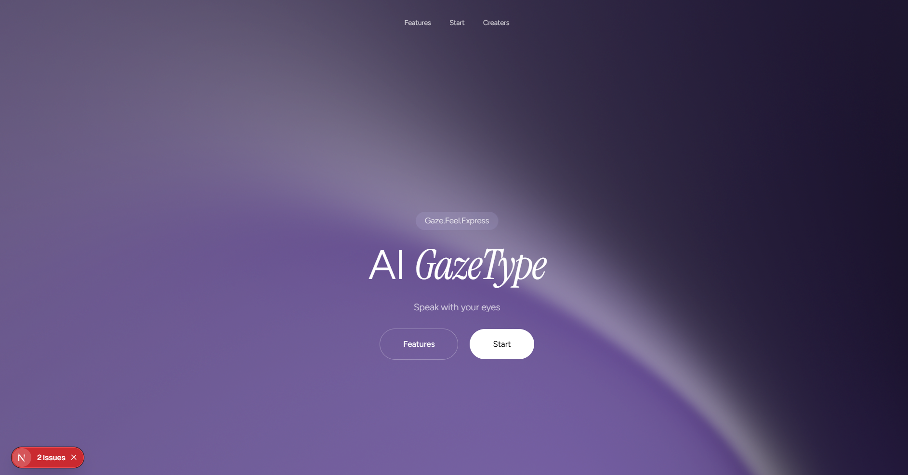
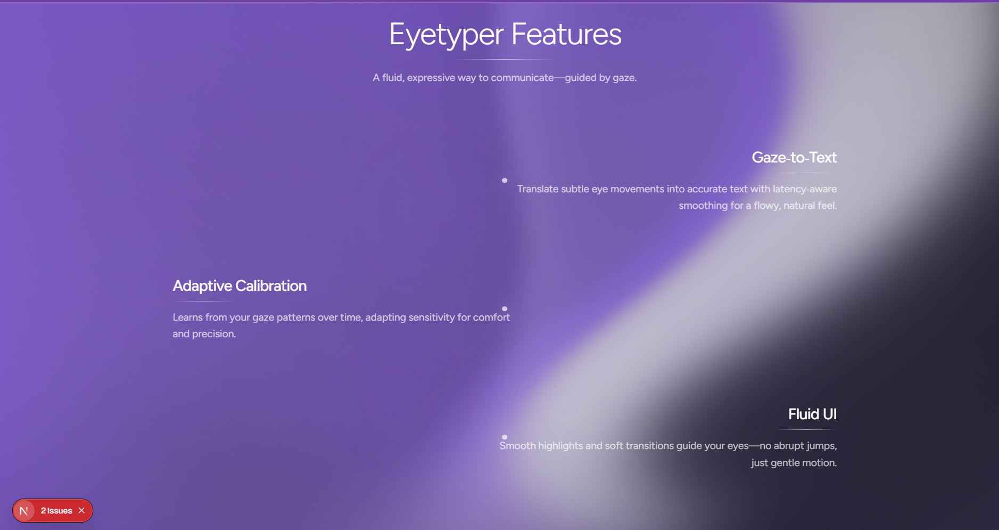
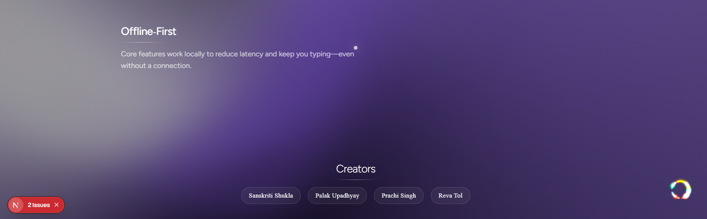
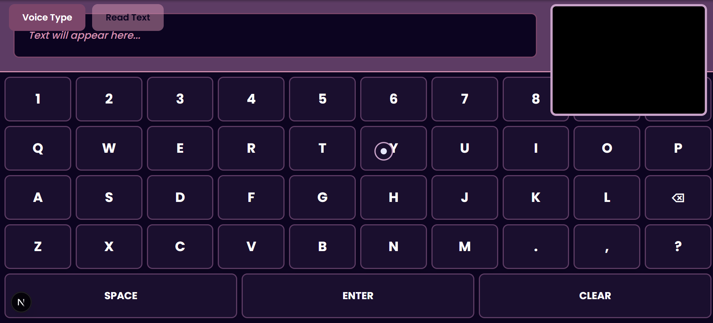

# 👁️‍🗨️ GazeType — Speak with Your Gaze  

### 🚀 Type with your eyes using AI-powered gaze tracking and speech synthesis  
**Live Demo:** [ai-gazetype.vercel.app](https://ai-gazetype.vercel.app)

---

## 📸 Screenshots

| Home Page | features | creators | Typing interface |
|------------|-----------------|----------------|----------------|
|  |  |  |  |


---

## 🧠 About the Project

**GazeType** is an assistive AI web app that allows users to **type with their gaze and communicate using text-to-speech**.  
It’s designed to empower people with limited mobility or speech by providing a **hands-free, voice-enabled typing experience** using just eye movement.

---

## ⚙️ Features

✅ Real-time gaze tracking using AI & computer vision  
✅ Automatic typing by focusing on keys for a few seconds  
✅ Integrated text-to-speech (TTS) engine  
✅ Minimal, modern UI built with Next.js + Tailwind CSS  
✅ Fully responsive and optimized for accessibility  

---

## 🧩 Tech Stack

| Category | Technology |
|-----------|-------------|
| Frontend | Next.js (App Router) |
| Styling | Tailwind CSS |
| Gaze Tracking | MediaPipe + OpenCV |
| Voice | pyttsx3 / Web Speech API |
| Hosting | Vercel |

---

## 🛠️ Getting Started

Follow these steps to run the project locally:

```bash
# Clone the repo
git clone https://github.com/<your-username>/ai-gazetype.git

# Navigate to the project directory
cd ai-gazetype

# Install dependencies
npm install

# Run the development server
npm run dev
```

---

# 👩‍💻 Developed By

Sanskriti
